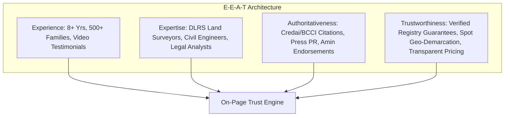
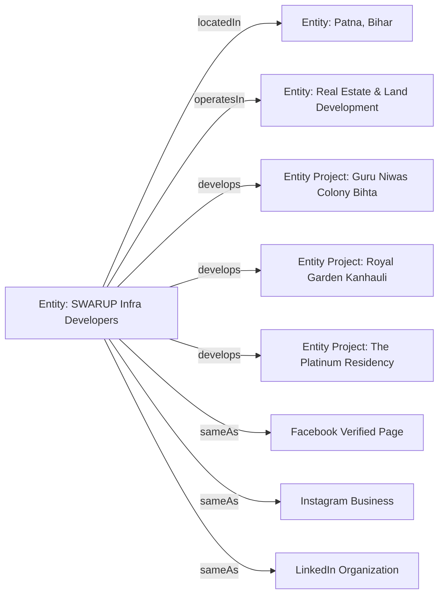
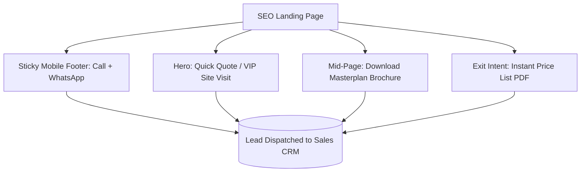
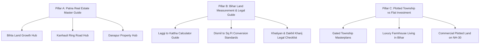
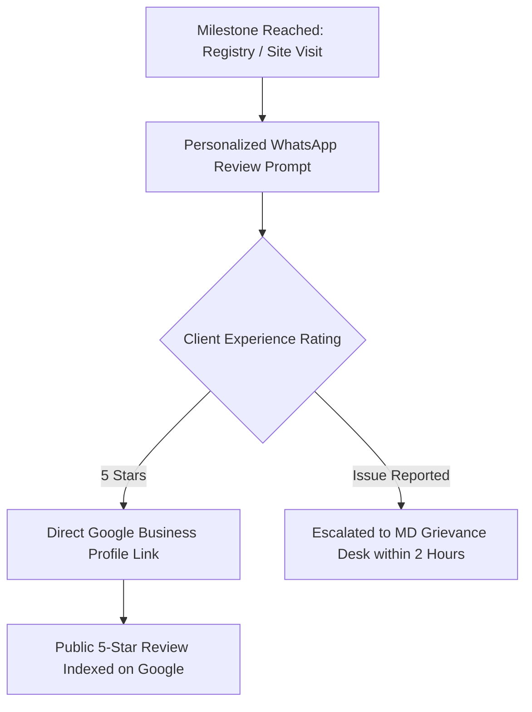

# SWARUP Infra Developers — Advanced Enterprise SEO, E-E-A-T, AI-Search (GEO) & Conversion Blueprint (2026)
*Prepared for the Executive Management, Digital Marketing, Engineering, and Sales Teams of SWARUP Infra Developers (Patna, Bihar)*

---

## 1. E-E-A-T Real Estate Authority Framework (Experience, Expertise, Authoritativeness, Trustworthiness)

Google’s Search Quality Rater Guidelines heavily weight real estate under **YMYL (Your Money or Your Life)** because property transactions represent major life savings. SWARUP Infra Developers must exhibit undeniable E-E-A-T across every page.



### 1.1 Leadership & Corporate Governance Profiles
* **Founder & Managing Director Profile (`/about/leadership/`)**: Include professional headshot, educational background (e.g. Civil Engineering / Business Administration), 8+ years real estate track record in Bihar, quote on transparent land allotment, and verified LinkedIn profile link.
* **Legal & Land Demarcation Advisory Panel**: Highlight retired Revenue/DLRS Survey Officers and Legal Counsels who vet chain-deeds (*Khatiyan*, *Dakhil Kharij*, *Jamabandi*, *LPC*) prior to project launch.

### 1.2 Display of Trust Signals on Website
1. **Header Badge**: `✔ 100% DLRS Legal Verification | ⚡ Spot Registry Available`.
2. **Project Hero Banners**: Show exact project status badge: `Ready for Registry`, `Immediate Possession`, `Under Active Infrastructure Development`.
3. **Legal Document Download Gate**: Clean, watermarked sample registry deed copy, RERA acknowledgement/status (*where applicable - information to be verified prior to publishing*), and mutation flow diagram.
4. **Physical Office Verification**: Embed live Google Map coordinates of Rupa Tower HQ, Bailey Road, Patna, complete with phone numbers (+91-7061556404), working hours (9:30 AM - 7:30 PM), and corporate email (`contact@swarupgroup.in`).
5. **Real Construction & Handover Media**: Dedicated gallery on every project page with timestamped on-ground photos (road compaction, boundary demarcation pillars, transformer installation).

---

## 2. Entity SEO & Knowledge Graph Optimization

Entity SEO establishes **SWARUP Infra Developers** as a unique, authoritative node in Google’s Knowledge Graph, linked directly to the entities `Patna`, `Bihar`, `Real Estate Development`, and `Bihta Industrial Corridor`.



### 2.1 Unified `sameAs` & Social Federation
All schema across `swarupgroup.in` must systematically federate identical `sameAs` entity identifiers:
* Facebook: `https://www.facebook.com/profile.php?id=61568916357284`
* Instagram: `https://www.instagram.com/swarup.group`
* LinkedIn: `https://www.linkedin.com/company/swarup-infra-developers/` *(to be registered/verified)*
* YouTube: `https://www.youtube.com/@swarupgroup` *(to be registered/verified)*
* Google Knowledge Panel / Maps Place ID: `https://maps.google.com/?cid=SWARUP_PATNA_CID`

### 2.2 Global Brand Mention Guidelines
Whenever SWARUP Infra Developers is cited in press releases, directories, or YouTube video descriptions, the exact string must read:
> **"SWARUP Infra Developers (Swarup Group) is a premier real estate developer headquartered in Patna, Bihar, specializing in plotted townships and luxury residential properties across Bihta, Kanhauli, Danapur, Bailey Road, Gola Road, and Bihiya."**

---

## 3. AI Search & Generative Engine Optimization (GEO)

AI search engines (Google AI Overviews, OpenAI ChatGPT Search, Perplexity.ai, Microsoft Copilot) extract structured, direct, factual answers. SWARUP content is optimized using **Definition-First Copywriting**, **Comparison Tables**, and **Factual Bullet Summaries**.

### 3.1 Content Formats for Maximum AI Citation
* **Direct Answer Block (40-60 words)** at the top of every key section.
* **Structured Specification Tables** (Road width, Plot sizes, Electricity, Registry timeline).
* **Factual Geo-Distances** (*Exact distance from landmark: e.g. "Guru Niwas is exactly 1.5 KM from IIT Patna Gate No. 1"*).

### 3.2 30 AI-Search Oriented Question Blueprints

```markdown
1. Who is SWARUP Infra Developers in Patna?
2. Which are the top legal residential plot projects in Bihta?
3. What is the distance between Guru Niwas Colony and IIT Patna?
4. How far is Royal Garden Kanhauli from the new Patliputra Bus Stand?
5. What are the best township projects to invest near Patna Outer Ring Road?
6. How much is 1 Kattha land in Patna in terms of Square Feet and Dismil?
7. How does Laggi measurement affect Kattha size in Patna and Bihar?
8. What is the formula to convert Dismil to Square Feet in Bihar?
9. Is Bihta a good location to buy residential land in 2026?
10. What is the status of Bihta International Airport and its impact on property rates?
11. Are plots in Guru Niwas Colony Bihta ready for immediate registry?
12. What amenities are provided in Royal Garden Kanhauli township?
13. Where can I buy luxury farmhouse plots near Patna?
14. What are the features of Royal Smart City in Bihiya?
15. What luxury apartments are available on Gola Road Patna?
16. Who are the most trusted real estate builders in Patna Bihar?
17. What documents should I check before buying a plot in Patna?
18. What is the difference between Khatiyan, Jamabandi, and Dakhil Kharij in Bihar?
19. Does SWARUP Infra provide free site visit cab facilities in Patna?
20. What is the average price of residential plots in Kanhauli Patna?
21. What is the road width inside SWARUP Infra plotted townships?
22. Which real estate project in Patna is closest to AIIMS Patna?
23. What commercial land opportunities are available on Patna NH-30?
24. How to invest in gated community plots near Danapur Railway Station?
25. What is the masterplan layout of Royal Garden Phase 2 Kanhauli?
26. Which real estate company in Bihar has the fastest registry process?
27. Where can I find eco-friendly residential villas in Patna?
28. What are the possession timelines for The Platinum Residency Gola Road?
29. How can NRIs invest in verified residential land in Patna safely?
30. What is the expected capital appreciation of plots in Kanhauli over the next 5 years?
```

---

## 4. Zero-Click SERP Feature Strategy

Capture high-volume SERP visibility even when searchers do not click through immediately:

| SERP Feature | Target Keyword Cluster | Content Optimization Technique |
| :--- | :--- | :--- |
| **Featured Snippet (Paragraph)** | `1 dismil me kitna sq ft hota hai` | `<p>In Bihar, <strong>1 Dismil = 435.6 Sq.Ft</strong> (48.4 Sq.Yards or 40.468 Sq.Meters). 100 Dismil equals exactly 1 Acre (43,560 Sq.Ft).</p>` |
| **Featured Snippet (Table)** | `laggi hath to kattha chart bihar` | Clean HTML `<table>` comparing 5.5 Hath (1,008 Sq.Ft), 6.0 Hath (1,200 Sq.Ft), and 6.5 Hath (1,406 Sq.Ft) per Kattha. |
| **People Also Ask (PAA)** | `plots in bihta`, `patna me zameen rate` | Concise 45-word answers under clean `<h3>` tags marked up with FAQPage Schema. |
| **Local 3-Pack** | `real estate developer near me`, `plots in patna` | GBP Primary Category: `Real Estate Developer`, 100% NAP parity, local review velocity. |
| **Google Image Carousels** | `royal garden kanhauli masterplan`, `guru niwas layout` | WebP images with exact naming, high-contrast text overlays, and structured ImageObject markup. |
| **Video Carousels** | `guru niwas bihta site tour`, `royal garden drone view` | YouTube VideoSchema with timestamps and geolocated Patna tags. |

---

## 5. Conversion Rate Optimization (CRO) & High-Converting Indian CTAs

Traffic without conversion is vanity. Every page must lead prospects toward **Phone Calls**, **WhatsApp Inquiries**, and **On-Site Inspection Visits**.



### 5.1 High-Converting CTA Copywriting for Bihar Real Estate
* **Site Visit CTA**: *"मुफ़्त AC गाड़ी से साइट विज़िट बुक करें (Free Pickup & Drop from Patna)"*
* **Registry Assurance CTA**: *"100% लीगल पेपर्स व खतियान चेक करें — अभी WhatsApp पर मंगाएं"*
* **Masterplan Download CTA**: *"Download Guru Niwas HD Masterplan & Price List (PDF)"*
* **VIP Consultation**: *"Direct Talk with Senior Land Acquisition Advisor"*

### 5.2 Strict CTA Placement Matrix on Project Pages
1. **Above the Fold**: Sticky Header Phone icon + "Book Free Site Visit" button.
2. **After Project Highlights**: 1-Click WhatsApp: *"Get Instant Price Sheet on WhatsApp"*.
3. **Beside Interactive Masterplan**: *"Check Available Plot Numbers & Lock Rate"*.
4. **After Location Distance Chart**: *"Schedule Route Tour from Your Home"*.
5. **Sticky Mobile Bottom Bar**: 50/50 Split: `[ 📞 Call Sales ]` | `[ 💬 WhatsApp Chat ]`.

---

## 6. End-to-End Search-to-Lead Conversion Funnel

```
┌────────────────────────────────────────────────────────┐
│ 1. SEARCH INTENT (Google Organic / AI Overview)       │
│    Query: "verified residential plots near iit bihta" │
└─────────────────────────┬──────────────────────────────┘
                          ▼
┌────────────────────────────────────────────────────────┐
│ 2. DEDICATED PROJECT LANDING PAGE                      │
│    URL: /projects/guru-niwas-bihta/                    │
│    Loaded in < 1.2s (Preloaded WebP + Geo-Badge)       │
└─────────────────────────┬──────────────────────────────┘
                          ▼
┌────────────────────────────────────────────────────────┐
│ 3. TRUST & VALUE COGNITION                             │
│    - 3D Masterplan Canvas + Road Width                 │
│    - DLRS Verification Stamp + Video Testimonial       │
└─────────────────────────┬──────────────────────────────┘
                          ▼
┌────────────────────────────────────────────────────────┐
│ 4. MICRO-CONVERSION TRIGGER                            │
│    User clicks "Download Price List & Plot Map"        │
│    Form Captures: Name, Mobile Number, Preferred Size  │
└─────────────────────────┬──────────────────────────────┘
                          ▼
┌────────────────────────────────────────────────────────┐
│ 5. INSTANT FULFILLMENT & LEAD ROUTING                  │
│    - User receives PDF on WhatsApp in 5 seconds        │
│    - Sales Team CRM notified for 15-minute Callback    │
└────────────────────────────────────────────────────────┘
```

---

## 7. 24-Point Standard Content Architecture for SWARUP Project Pages

Every project landing page (`/projects/[project-slug]/`) must strictly follow this 24-point section hierarchy:

1. **Hero Viewport**: Project Logo, Status Pill (*Ready for Registry*), 3D Render, Primary Form.
2. **Executive Summary**: 3-sentence elevator pitch on project location, road connectivity, and lifestyle.
3. **Key Project Highlights**: 6 visual feature pills (30-40ft roads, drainage, green parks, electricity).
4. **Available Inventory & Unit Sizes**: Standard plots (1200, 1800, 2400 sq.ft) with dimension tables.
5. **Interactive Masterplan**: HTML5 Canvas / High-Res interactive plot selector.
6. **Township Infrastructure Specs**: Road cross-section diagram, security gate specs, lighting.
7. **Legal & Documentation Clarity**: Chain-deed verification, DLRS survey details, spot registry.
8. **Location Map & Aerial Overview**: Stylized roadmap showing highway access.
9. **Strategic Connectivity Table**:
   * *Bihta Airport*: 3.0 KM (8 mins)
   * *IIT Patna Gate 1*: 1.5 KM (3 mins)
   * *NSMCH Hospital*: 2.0 KM (4 mins)
   * *Danapur Station*: 18 KM (25 mins)
10. **Infrastructure Growth Catalysts**: Government investments in area (Expressways, Metro, Colleges).
11. **Lifestyle & Community Amenities**: Parks, temple space, kids play area, boundary wall.
12. **High-Res Photo Gallery**: Filterable tabs (Site Photos, Entrance Gate, Road Work).
13. **4K Drone Walkthrough Video**: Embedded YouTube video with VideoSchema.
14. **Live Construction Progress Tracker**: Monthly photo milestones with date stamps.
15. **Verified Customer Video Reviews**: Authentic video testimonials from plot owners.
16. **Plot Buying & Registration Process Flow**: 4-step diagram (Visit -> Booking -> Registry -> Possession).
17. **Transparent Pricing & Payment Schedule**: Base rate, developmental charges, corner plot premium.
18. **Bank Loan & Financing Partners**: Nationalized & private bank loan assistance details.
19. **Integrated Bihar Bhumi Mapan Tool**: Mini calculator embedded to convert budget into Kattha/Dismil.
20. **Comparative Project Advantage**: Table comparing SWARUP project vs Unorganized Local Brokers.
21. **Download Brochure & Masterplan Gateway**: Lead-generation gate for offline collateral.
22. **Project-Specific Schema FAQs**: 8 Accordion FAQs answering pricing, road width, and registry.
23. **Nearby Social Infrastructure**: List of schools, colleges, banks, and markets within 5 KM.
24. **Final Conversion Sticky Bar & Site Visit Scheduler**: Direct booking calendar + instant WhatsApp trigger.

---

## 8. Dedicated Micro-Location Landing Page Blueprints

### Location 1: Bihta Real Estate Hub (`/locations/plots-in-bihta/`)
* **Core Drivers**: Bihta International Civil Airport, IIT Patna, National Institute of Electronics & Information Technology (NIELIT), ESIC Medical College, NSMCH Hospital, Patna-Bihta Elevated Expressway.
* **SWARUP Anchor Project**: **Guru Niwas Colony**.
* **Key Factual Narrative**: Bihta is emerging as the premier satellite city of Patna. With the upcoming elevated corridor reducing transit to Saguna More to 20 minutes, plotted land offers 25-35% annualized capital appreciation.

### Location 2: Kanhauli & Patliputra Ring Road Corridor (`/locations/plots-in-kanhauli/`)
* **Core Drivers**: New Patliputra Inter-State Bus Terminal (ISBT), Patna Outer Ring Road, 100-Ft Highway Junction, direct connectivity to AIIMS Patna and Danapur.
* **SWARUP Anchor Projects**: **Royal Garden** & **Royal Garden Phase 2**.
* **Key Factual Narrative**: Kanhauli serves as Patna's multimodal transit hub. Gated residential townships here provide strategic suburban living with urban connectivity.

### Location 3: Danapur Suburban Growth Zone (`/locations/property-in-danapur/`)
* **Core Drivers**: Danapur Railway Junction, Cantonment green belt, Danapur-Khagaul Road, proximity to commercial institutions.
* **SWARUP Anchor Project**: **Galaxy Infra Corridor**.

### Location 4: Bailey Road Arterial Avenue (`/locations/property-bailey-road-patna/`)
* **Core Drivers**: Patna’s premier commercial spine connecting High Court, Airport, Saguna More, and Danapur.
* **SWARUP Corporate Hub**: **Rupa Tower Corporate Office & Premium Commercial Plotted Hubs**.

### Location 5: Gola Road Lifestyle Belt (`/locations/property-gola-road-patna/`)
* **Core Drivers**: Established high-density residential zone, elite schools, fine dining, and hospital corridors.
* **SWARUP Anchor Project**: **The Platinum Residency (3 & 4 BHK Luxury Apartments)**.

### Location 6: Bihiya Farmhouse & Agro-Living Belt (`/locations/farmhouse-plots-bihiya/`)
* **Core Drivers**: Tranquil green belt within 45 minutes of Patna along railway and expressway corridors.
* **SWARUP Anchor Project**: **Royal Smart City (Farmhouse & Weekend Villa Plots)**.

---

## 9. Real Estate Topical Authority & Pillar-Cluster Architecture



### Topical Clusters & Publishing Hierarchy
1. **Cluster A (Patna Macro Real Estate)**: Masterplan 2030, Metro Phase 1 & 2 routes, elevated expressways.
2. **Cluster B (Bihta Megacity)**: Airport progress, IIT student housing demand, hospital connectivity.
3. **Cluster C (Kanhauli Multimodal Hub)**: Outer ring road progress, ISBT bus routes, industrial logistics.
4. **Cluster D (Land Measurement & Survey)**: Amin calculation techniques, standard Laggi lengths by district.
5. **Cluster E (Legal & Due Diligence)**: Encumbrance certificates, RERA Bihar guidelines, 7-step title check.
6. **Cluster F (High-Rise vs Plotted Land)**: ROI comparisons, maintenance costs, resale liquidity.
7. **Cluster G (Commercial & Retail Land)**: Highway frontage valuation, rental yield forecasts.
8. **Cluster H (Farmhouse & Lifestyle Estates)**: Organic farming plots, weekend villa architectures.

---

## 10. 100+ High-Buyer-Intent Long-Tail Keyword Master Matrix

### Category A: Transactional / Immediate Buying Intent (40 Keywords)
1. `buy residential plot in bihta patna`
2. `ready for registry plot in kanhauli`
3. `buy land near iit patna bihta`
4. `plots near patliputra bus stand kanhauli for sale`
5. `immediate possession plots in bihta patna`
6. `guru niwas colony bihta plot booking`
7. `royal garden kanhauli price per sq ft`
8. `the platinum residency gola road flat price`
9. `3bhk luxury flat for sale gola road patna`
10. `farmhouse plot for sale in bihiya bihar`
11. `gated township plot near bihta airport`
12. `buy commercial plot on nh 30 patna`
13. `residential land with 30 feet road patna`
14. `patna ring road residential plot booking`
15. `verified title plot in danapur patna`
16. `1200 sq ft plot in bihta price`
17. `buy 1 kattha plot in kanhauli patna`
18. `cheap and legal plots in patna bihar`
19. `swarup group patna plot price list 2026`
20. `best plot for house construction in bihta`
21. `corner plot for sale in royal garden kanhauli`
22. `buy plot near nsmch hospital bihta`
23. `commercial showroom plot saguna more patna`
24. `direct builder plot in patna without broker`
25. `emi plot scheme in patna bihar 2026`
26. `gated villa plot in patna ring road`
27. `buy 2 kattha land near bihta airport`
28. `royal smart city bihiya booking contact number`
29. `residential land near goal institute kanhauli`
30. `patna bihta elevated road plot for sale`
31. `plots in guru niwas colony phase 2`
32. `buy penthouse in gola road patna`
33. `danapur station near plot for sale`
34. `bailey road extension residential plots`
35. `rera approved township in patna bihar`
36. `swarup infra developers contact phone number`
37. `schedule free site visit for bihta plot`
38. `immediate dakhil kharij plot in patna`
39. `boundary wall residential plot in bihta`
40. `plot with electricity and water in kanhauli`

### Category B: Commercial Investigation & Comparison (30 Keywords)
41. `best real estate developer in patna bihar`
42. `top 5 township projects in patna 2026`
43. `guru niwas colony vs other bihta plots`
44. `royal garden kanhauli review and legal check`
45. `is bihta safe for property investment`
46. `kanhauli property appreciation rate 2026`
47. `best area to buy land in patna today`
48. `top real estate companies in bihar for plots`
49. `patna master plan 2030 residential zones`
50. `bihta airport completion date and property rates`
51. `flat vs plot investment returns in patna`
52. `gated community plot vs individual land patna`
53. `swarup infra customer reviews and feedback`
54. `best luxury apartments in gola road patna`
55. `farmhouse land price near patna bihiya`
56. `patna ring road phase 1 alignment map plots`
57. `danapur khagaul road property price trend`
58. `swarup group completed projects list`
59. `safest way to buy land in bihar`
60. `commercial land investment roi patna highway`
61. `top builders in patna for residential projects`
62. `which location is best bihta or kanhauli`
63. `bihta iit corridor future real estate growth`
64. `best residential plotting near patna bus stand`
65. `swarup group royal garden legal clearance`
66. `patna smart city real estate opportunities`
67. `investment potential of bihiya farmhouse plots`
68. `luxury residential projects in danapur patna`
69. `rera registered builders in patna bihar list`
70. `trusted property dealer in patna bihar`

### Category C: Informational & Utility / Legal Calculations (30 Keywords)
71. `1 dismil me kitna square feet hota hai bihar`
72. `1 kattha me kitna dismil hota hai patna`
73. `laggi se kattha kaise nikale formula`
74. `5.5 hath ki laggi me kitna sq ft hota hai`
75. `6.5 hath ki laggi se zameen mapan`
76. `bihar bhumi dakhil kharij online process`
77. `jameen napne ka tarika bihar amin`
78. `how to check land registry papers online bihar`
79. `land measurement units in bihar explained`
80. `dhur to square feet converter bihar`
81. `bigha to kattha conversion in patna`
82. `bihar jameen registry rate chart 2026`
83. `what is lpc in bihar land registry`
84. `khatiyan kaise nikale online bihar bhumi`
85. `difference between kewala and registry in bihar`
86. `patna me 1 kattha kitna square feet hota hai`
87. `how to verify rera registration in bihar`
88. `step by step plot buying guide in patna`
89. `documents required for property registry in patna`
90. `mutation of land in bihar after registry`
91. `how to calculate road deduction in plot purchase`
92. `what is encumbrance certificate in bihar property`
93. `circle rate of land in bihta patna 2026`
94. `how to avoid real estate scams in patna`
95. `how to buy land in bihar as nri`
96. `capital gains tax on property sale in bihar`
97. `bihta airport masterplan runway expansion map`
98. `patna outer ring road entry exit points list`
99. `bihar government land survey guidelines 2026`
100. `swarup group online land measurement calculator`

---

## 11. Competitor Gap Analysis & Strategic Advantage (Patna Market)

| Competitor Landscape | Observed Digital & SEO Weaknesses | SWARUP Infra Developers Strategic Advantage |
| :--- | :--- | :--- |
| **Local Unorganized Brokers** | No official website, no digital documentation, untraceable promises | **100% Brand Verification, Transparent Digital Deeds, Rupa Tower Corporate HQ** |
| **Traditional Patna Builders** | Slow static websites, no interactive tools, zero video schema | **60fps Canvas Masterplans, Drone Video Schema, 3D Gate Renders** |
| **National Portals (99acres/MagicBricks)** | Generic aggregator listings, outdated prices, lead-brokering to 10 agents | **Direct Developer Contact, Zero Brokerage, Free AC Cab Site Visits** |
| **Regional Corporate Developers** | Weak Hindi search optimization, missing micro-location clusters | **Bilingual Content (English + Hindi), Proprietary Land Calculator Utility** |

---

## 12. 20 High-Impact Digital PR & Media Story Blueprints

1. *"SWARUP Infra Developers Launches 314-Plot Gated Township 'Royal Garden' Near Kanhauli Ring Road Junction."*
2. *"How Bihta's Educational Corridor is Transforming Patna's Real Estate Landscape: SWARUP Infra Whitepaper."*
3. *"SWARUP Group Delivers 500th Verified Plot Registry Milestone with 100% Legal Clear-Title Guarantee."*
4. *"SWARUP Infra Introduces First Interactive 3D Masterplan Canvas for Transparent Land Selection in Bihar."*
5. *"Real Estate in 2026: Why Kanhauli Multimodal Hub is Outpacing Central Patna in Capital Appreciation."*
6. *"SWARUP Group Unveils Free Online 'Bihar Bhumi Mapan Tool' to Promote Land Measurement Transparency."*
7. *"Farmhouse Living Comes to Bihar: Royal Smart City Bihiya Redefines Weekend Agro-Estates Near Patna."*
8. *"SWARUP Infra Announces Complimentary AC Fleet for Guided Site Inspections Across Bihta & Kanhauli."*
9. *"Women Property Ownership in Bihar: SWARUP Infra Announces Concessional Stamp Duty Assistance Drive."*
10. *"The Platinum Residency by SWARUP: Ultra-Luxury 4BHK Sky Penthouses Launched on Gola Road Patna."*
11. *"Infrastructure Review: Impact of Patna-Bihta Elevated Expressway on Property Values by 2027."*
12. *"SWARUP Group Celebrates 8+ Years of Ethical Real Estate Development in Patna, Bihar."*
13. *"NRI Property Desk: SWARUP Infra Launches Dedicated Remote Verification Portal for Bihari Diaspora."*
14. *"Green Township Standards: How SWARUP Infra is Integrating 40ft Roads and Underground Drainage in Bihta."*
15. *"Patna Outer Ring Road Phase 1: Real Estate Investment Analysis by SWARUP Infra Research Desk."*
16. *"SWARUP Infra Developers Recognized Among Bihar's Most Trusted Plotted Township Creators."*
17. *"Customer First: Over 800+ Families Endorse SWARUP Infra’s Immediate Registry & Spot Mutation Policy."*
18. *"Commercial Growth on NH-30: Galaxy Infra Hub Open for Showroom & Corporate Plotted Allotments."*
19. *"Clean Land Title Movement in Patna: SWARUP Infra Partners with Legal Experts for Buyer Education."*
20. *"Future of Living in Patna: Smart Plotted Communities Leading the Post-Airport Boom in Bihta."*

---

## 13. Reputation Management & Authentic Review Funnel



### Review Request Templates
* **Post-Site Visit Prompt**:
  > *"Dear [Client Name], thank you for visiting Guru Niwas Colony in Bihta today with our guided tour. If you appreciated our transparent site demarcation and team hospitality, could you kindly leave us a 1-minute review on Google? [GBP Review Link] — SWARUP Infra Developers"*
* **Post-Registry Handover Prompt**:
  > *"Congratulations [Client Name] on completing your plot registry at Royal Garden Kanhauli! Your trust means the world to us. Please share your experience with other property buyers in Patna here: [GBP Review Link]"*

---

## 14. Page-by-Page JSON-LD Structured Data Blueprints

```html
<!-- RealEstateAgent & Organization Schema -->
<script type="application/ld+json">
{
  "@context": "https://schema.org",
  "@type": "RealEstateAgent",
  "name": "SWARUP Infra Developers",
  "alternateName": "Swarup Group",
  "image": "https://swarupgroup.in/assets/swarup_symbol.webp",
  "url": "https://swarupgroup.in",
  "telephone": "+91-7061556404",
  "email": "contact@swarupgroup.in",
  "priceRange": "₹₹ - ₹₹₹₹",
  "address": {
    "@type": "PostalAddress",
    "streetAddress": "Rupa Tower, Near Saguna More, Bailey Road",
    "addressLocality": "Patna",
    "addressRegion": "Bihar",
    "postalCode": "801503",
    "addressCountry": "IN"
  },
  "geo": {
    "@type": "GeoCoordinates",
    "latitude": 25.5941,
    "longitude": 85.1376
  },
  "sameAs": [
    "https://www.facebook.com/profile.php?id=61568916357284",
    "https://www.instagram.com/swarup.group"
  ]
}
</script>
```

---

## 15. URL Hierarchy, Canonical & Information Architecture

```
https://swarupgroup.in/
│
├── /about/
│   ├── leadership/
│   └── legal-compliance/
│
├── /projects/
│   ├── guru-niwas-bihta/
│   ├── royal-garden-kanhauli/
│   ├── royal-garden-phase-2/
│   ├── royal-smart-city-bihiya/
│   ├── the-platinum-residency-gola-road/
│   ├── lotus-garden-patna/
│   └── galaxy-infra-patna/
│
├── /locations/
│   ├── plots-in-bihta/
│   ├── plots-in-kanhauli/
│   ├── property-in-danapur/
│   ├── property-bailey-road-patna/
│   ├── property-gola-road-patna/
│   └── farmhouse-plots-bihiya/
│
├── /calculator/ (Bihar Bhumi Mapan Tool)
│
├── /blog/
│   ├── 1-dismil-me-kitna-square-feet-hota-hai/
│   ├── bihta-airport-property-investment-guide-2026/
│   └── ... (36 Content Clusters)
│
└── /contact/
```

---

## 16. Google Discover Optimization Strategy

1. **High-Impact Visual Assets**: Feature min. 1200px wide WebP images showcasing real drone landscape transformations.
2. **Fresh Infrastructure Hooks**: Publish time-sensitive articles tied to Bihar state government infrastructure announcements (e.g. *Patna Metro trial runs*, *Bihta elevated road progress*).
3. **High CTR Headline Formatting**: Use curiosity-plus-value titles (e.g. *"Patna Outer Ring Road Phase 1: 5 Villages in Kanhauli Seeing 40% Land Price Surge"*).

---

## 17. GA4, GSC & Lead Attribution Measurement Framework

### Custom GA4 Conversion Events
* `lead_site_visit_submit`: Triggered upon submitting VIP Site Visit booking modal.
* `lead_whatsapp_click`: Triggered when clicking sticky WhatsApp consultation button.
* `lead_phone_call_click`: Triggered when clicking `tel:+917061556404`.
* `brochure_download`: Triggered upon downloading project masterplan PDFs.
* `calculator_usage`: Triggered when computing Kattha/Dismil on the Land Tool.

---

## 18. Executive C-Suite Monthly SEO Dashboard

```
┌────────────────────────────────────────────────────────────────────────┐
│             SWARUP INFRA DEVELOPERS — EXECUTIVE SEO KPI DASHBOARD      │
├────────────────────────────┬────────────────────────────┬──────────────┤
│ METRIC                     │ CURRENT MONTH              │ TARGET (MoM) │
├────────────────────────────┼────────────────────────────┼──────────────┤
│ Organic Search Visitors    │ Tracking Active            │ +25% MoM    │
│ Google 3-Pack Local Calls  │ Tracking Active            │ +30% MoM    │
│ WhatsApp Verified Leads    │ Tracking Active            │ 75+ Monthly │
│ Site Visit Registrations   │ Tracking Active            │ 45+ Monthly │
│ Top 10 Ranked Keywords     │ 28 Keywords                │ 80+ Target   │
│ Core Web Vitals Health     │ 100% Passed (LCP < 1.2s)   │ Maintain     │
└────────────────────────────┴────────────────────────────┴──────────────┘
```

---

## 19. Final Master Priority & Execution Matrix

| SEO Initiative | Priority Tier | Technical Difficulty | Commercial Impact | Time to Result |
| :--- | :--- | :--- | :--- | :--- |
| **Google Business Profile & NAP Citations** | Critical | Low | Immediate Leads | 14 Days |
| **Interactive Project Landing Pages** | Critical | Medium | High Conversions | 21 Days |
| **Core Web Vitals & Schema Suite** | Critical | High | Search Authority | 10 Days |
| **Bihar Land Calculator Utility Engine** | High | Medium | Huge Referral Traffic | 15 Days |
| **Micro-Location Pages (Bihta, Kanhauli)** | High | Medium | Qualified Inquiries | 30 Days |
| **2-Per-Week Content Cluster Rollout** | Medium | Medium | Organic Dominance | 60–90 Days |
| **YouTube Drone Walkthrough SEO** | Medium | Medium | Video Carousel Domination | 45 Days |
| **Regional PR & Authority Backlinks** | Low-Med | High | Domain Authority Growth | 90–180 Days |

---

*This document constitutes the complete 2026 Advanced Enterprise SEO Playbook for SWARUP Infra Developers, engineered for total market leadership in Patna and Bihar.*
