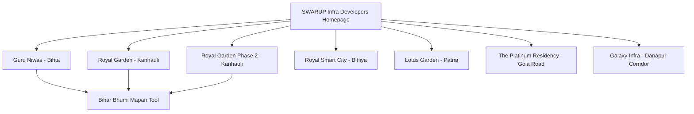
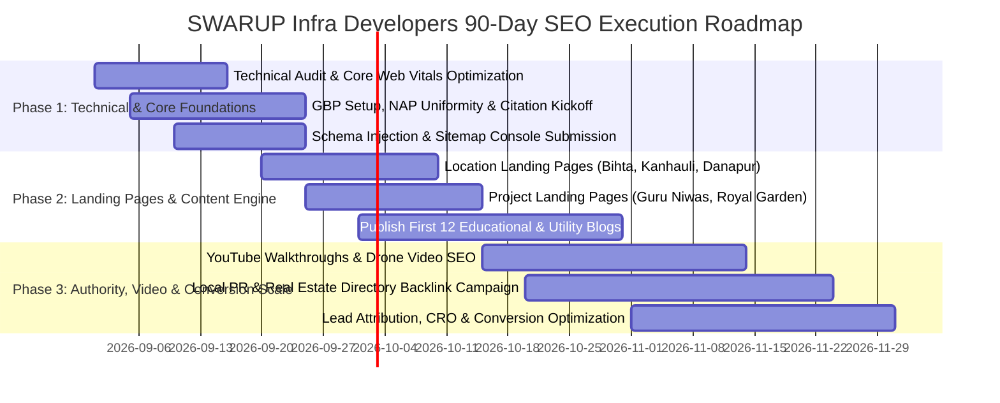

# Comprehensive 2026 SEO Strategy & Execution Playbook
## SWARUP Infra Developers | Patna, Bihar, India

---

## 1. Executive Summary & Brand Positioning

**SWARUP Infra Developers** (operating as Swarup Group) is a premier infrastructure and real estate development firm in Patna, Bihar. This SEO blueprint is engineered to capture high-intent property buyers, high-net-worth investors, NRI Bihari diaspora, and commercial clients looking for verified, high-appreciation land, luxury townships, and residential apartments across Patna's high-growth corridors.

### Core Value Proposition
* **100% DLRS & RERA-Compliant Title Verification** (Immediate Registry & Mutation Guarantee).
* **High-Growth Corridors**: Strategic projects along Bihta Airport Corridor, Kanhauli Patliputra Ring Road Junction, Bailey Road, Danapur Station Belt, Gola Road, and Bihiya.
* **Modern Integrated Townships**: Gated communities with 30-40 ft wide arterial roads, underground drainage, green parks, and 24/7 security.
* **Bilingual Consumer Utility**: Proprietary online *Bihar Bhumi Mapan Calculator* driving organic utility traffic and top-of-funnel lead generation.

---

## 2. Comprehensive Keyword Architecture & Clustering

### 2.1 Brand & Corporate Keyword Cluster
| Primary Keyword | Secondary Keywords | Search Intent | Priority |
| :--- | :--- | :--- | :--- |
| **swarup infra developers** | swarup group patna, swarup developers bihar, swarup builders patna | Navigational / Commercial | High |
| **real estate developer in patna** | real estate company in patna, best property builders patna | Commercial Investigation | Critical |
| **top real estate company in bihar** | leading builders in bihar, trusted land developers patna | Informational / Commercial | High |
| **swarup group plots** | swarup infra contact number, swarup group office patna | Navigational / Transactional | Critical |

### 2.2 Core Commercial Real Estate Clusters
* **Residential Plots**: `residential plots in patna`, `buy plot in patna`, `plots for sale in patna`, `gated community plots patna`, `verified land in patna`, `immediate registry plots patna`, `patna me zameen`, `patna me plot rate`.
* **Township Developments**: `township projects in patna`, `luxury township in bihar`, `mega residential township patna`, `smart city plots patna`.
* **Apartments & Flats**: `luxury apartments in patna`, `flats for sale in patna`, `3bhk flats in patna`, `penthouse in patna`, `ready to move flats in patna`.
* **Commercial Properties**: `commercial plots in patna`, `commercial land near nh-30`, `showroom space for sale patna`, `commercial space saguna more`.
* **Land Investment**: `property investment in bihar`, `land investment patna 2026`, `high roi property patna`, `future appreciation plots bihta`.

---

## 3. Micro-Location SEO Strategy & Landing Page Wireframes

### 3.1 Bihta Corridor (The Educational & Industrial Epicenter)
* **Target Keywords**: `property in bihta`, `plots in bihta`, `residential plots in bihta`, `plots near iit bihta`, `property near bihta international airport`, `land near nsmch bihta`, `bihta me zameen rate`.
* **Strategic Angle**: Proximity to IIT Patna, Bihta International Airport, ESIC Medical College, and NSMCH Hospital. High capital appreciation zone.
* **Target Landing Page URL**: `https://swarupgroup.in/locations/plots-in-bihta/`

### 3.2 Kanhauli & Patliputra Bus Stand Corridor
* **Target Keywords**: `property in kanhauli`, `plots in kanhauli`, `township in kanhauli`, `residential plots near kanhauli bus stand`, `plots near patna ring road junction`, `kanhauli real estate`.
* **Strategic Angle**: 500 meters from New ISBT Patliputra Bus Stand & Patna Outer Ring Road. Fast-track connectivity to Danapur, AIIMS, and Central Patna.
* **Target Landing Page URL**: `https://swarupgroup.in/locations/plots-in-kanhauli/`

### 3.3 Danapur & Saguna More Belt
* **Target Keywords**: `property in danapur`, `plots in danapur patna`, `residential property near danapur station`, `real estate developer in danapur`, `flats near saguna more patna`.
* **Strategic Angle**: Established urban hub with railway connectivity, premium schools, and bustling commercial infrastructure.
* **Target Landing Page URL**: `https://swarupgroup.in/locations/property-in-danapur/`

### 3.4 Bailey Road Extension
* **Target Keywords**: `property in bailey road patna`, `plots near bailey road patna`, `luxury flats bailey road`, `commercial property bailey road patna`, `real estate developer bailey road`.
* **Strategic Angle**: Patna's most prestigious commercial-cum-residential arterial avenue connecting AIIMS, Saguna More, and Bihta.
* **Target Landing Page URL**: `https://swarupgroup.in/locations/property-bailey-road-patna/`

### 3.5 Gola Road Corridor
* **Target Keywords**: `property in gola road`, `residential projects gola road patna`, `flats in gola road`, `gola road property investment`, `the platinum residency gola road`.
* **Strategic Angle**: High-density lifestyle residential hub close to Bailey Road, shopping hubs, and top hospitals.
* **Target Landing Page URL**: `https://swarupgroup.in/locations/property-gola-road-patna/`

---

## 4. Project-Wise Deep-Dive SEO Strategy



---

### Project 1: Guru Niwas Colony (Bihta)
* **SEO Title**: Guru Niwas Colony Bihta | Verified Residential Plots Near IIT Patna & Airport
* **Meta Description**: Buy 100% legally verified residential plots in Guru Niwas Colony, Bihta by Swarup Infra. 1.5 KM from IIT Patna & Bihta Airport. Immediate registry, 30-ft wide roads. Book site visit!
* **Target URL**: `https://swarupgroup.in/projects/guru-niwas-bihta/`
* **Heading Structure**:
  * **H1**: Guru Niwas Colony: Premium Residential Plots in Bihta, Patna
  * **H2**: Why Invest in Plots Near IIT Patna & Bihta Airport?
  * **H2**: Masterplan Layout, Road Demarcation & Infrastructure Features
  * **H2**: Strategic Location & Connectivity Advantages
  * **H2**: Price List, Plot Sizes (1200 - 2400 Sq.Ft) & Instant Registry
  * **H3**: 1.5 KM from IIT Patna Gate No. 1
  * **H3**: 2 KM from NSMCH Medical College & Hospital
  * **H3**: 3 KM from Bihta Civil Enclave Airport
* **Primary Keyword**: `guru niwas bihta`
* **Secondary Keywords**: `plots near iit bihta`, `township near bihta airport`, `residential plots in bihta patna`, `guru niwas colony price`.
* **Long-Tail Keywords**: `how to buy verified plot near iit patna bihta`, `bihta me immediate registry plot rate`.
* **Alt-Text Examples**:
  * `guru-niwas-bihta-township-masterplan-layout.webp`: *Guru Niwas Colony Bihta 3D Masterplan Layout showing 30ft road network*
  * `guru-niwas-plots-near-iit-patna-gate.webp`: *Residential plots demarcated at Guru Niwas Bihta near IIT Patna*
* **FAQ Schema Highlights**:
  * *Q: Is Guru Niwas Colony approved with immediate registry?* -> A: Yes, 100% DLRS verified title with immediate registry and spot possession.
  * *Q: What are the available plot dimensions?* -> A: Available in standard sizes of 1200 sq ft, 1800 sq ft, and 2400 sq ft.

---

### Project 2: Royal Garden (Kanhauli, Patna)
* **SEO Title**: Royal Garden Kanhauli Patna | Luxury Villa Plots Near Patliputra Bus Stand
* **Meta Description**: Discover Royal Garden by Swarup Infra at Kanhauli, Patna. Premium villa plots 500M from Patliputra Bus Stand & Outer Ring Road. 100% legal, gated security & underground amenities.
* **Target URL**: `https://swarupgroup.in/projects/royal-garden-kanhauli/`
* **H1**: Royal Garden: Luxury Villa Township Plots in Kanhauli, Patna
* **Primary Keyword**: `royal garden kanhauli`
* **Secondary Keywords**: `royal garden patna`, `plots near kanhauli bus stand`, `township in kanhauli`, `gated plots patna ring road`.
* **Alt-Text Examples**:
  * `royal-garden-kanhauli-grand-entrance-arch.webp`: *Royal Garden Kanhauli 3D Grand Entrance Gate and 40ft Main Boulevard*
  * `royal-garden-patna-interactive-plot-canvas.webp`: *Interactive plot selection masterplan of Royal Garden Kanhauli*

---

### Project 3: Royal Garden Phase 2 (Kanhauli Extension)
* **SEO Title**: Royal Garden Phase 2 Kanhauli | Eco-Residential Plots on Patna Ring Road
* **Meta Description**: Invest in Royal Garden Phase 2 at Kanhauli, Patna. Premium eco-friendly township plots with club amenities, wide blacktop roads, and direct access to Patna Ring Road.
* **Target URL**: `https://swarupgroup.in/projects/royal-garden-phase-2/`
* **H1**: Royal Garden Phase 2: Next-Generation Gated Township in Kanhauli
* **Primary Keyword**: `royal garden phase 2`
* **Secondary Keywords**: `royal garden phase 2 kanhauli`, `residential land near patliputra isbt`, `pre-launch plot booking kanhauli`.

---

### Project 4: Royal Smart City (Bihiya)
* **SEO Title**: Royal Smart City Bihiya | Luxury Farmhouse Plots & Second Homes Near Patna
* **Meta Description**: Build your dream farmhouse at Royal Smart City, Bihiya. Gated weekend villa & organic farmhouse plots with orchard landscaping, clubhouse, and resort amenities.
* **Target URL**: `https://swarupgroup.in/projects/royal-smart-city-bihiya/`
* **H1**: Royal Smart City: Luxury Farmhouses & Weekend Homes in Bihiya
* **Primary Keyword**: `royal smart city bihiya`
* **Secondary Keywords**: `farmhouse project bihiya`, `farmhouse near patna`, `second home plots bihar`, `organic farm plots bihiya`.
* **Alt-Text Examples**:
  * `royal-smart-city-bihiya-farmhouse-concept.webp`: *Luxury farmhouse design with landscaped garden at Royal Smart City Bihiya*

---

### Project 5: The Platinum Residency (Gola Road, Patna)
* **SEO Title**: The Platinum Residency Gola Road Patna | Premium 3 & 4 BHK Luxury Apartments
* **Meta Description**: Experience ultra-luxury living at The Platinum Residency, Gola Road, Patna. Premium 3BHK & 4BHK apartments with sky lounge, rooftop pool, and 3-tier security.
* **Target URL**: `https://swarupgroup.in/projects/the-platinum-residency-gola-road/`
* **H1**: The Platinum Residency: Luxury High-Rise Living on Gola Road, Patna
* **Primary Keyword**: `the platinum residency gola road`
* **Secondary Keywords**: `platinum residency patna`, `luxury flats in gola road patna`, `3bhk apartments gola road`, `high rise project gola road`.

---

### Project 6: Lotus Garden (Patna Green Belt)
* **SEO Title**: Lotus Garden Patna | Nature-Centric Residential Gated Plots & Villas
* **Meta Description**: Lotus Garden by Swarup Infra offers serene, green residential plotting in Patna. Beautiful landscaped parks, jogging tracks, and 100% clear legal documentation.
* **Target URL**: `https://swarupgroup.in/projects/lotus-garden-patna/`
* **H1**: Lotus Garden: Eco-Friendly Residential Enclave in Patna
* **Primary Keyword**: `lotus garden patna`
* **Secondary Keywords**: `lotus garden plots patna`, `eco township patna`, `green residential plots bihar`.

---

### Project 7: Galaxy Infra (Commercial & Mixed-Use Hub)
* **SEO Title**: Galaxy Infra Patna | Prime Commercial & Retail Plots on NH-30 Corridor
* **Meta Description**: Premium commercial plots and retail spaces by Galaxy Infra (Swarup Group) on Patna NH-30 highway corridor. Ideal for corporate offices, retail hubs, and showrooms.
* **Target URL**: `https://swarupgroup.in/projects/galaxy-infra-patna/`
* **H1**: Galaxy Infra: Commercial High-Street & Corporate Plotted Development
* **Primary Keyword**: `galaxy infra patna`
* **Secondary Keywords**: `commercial plots on nh-30 patna`, `commercial showroom land patna`, `galaxy infra commercial hub`.

---

## 5. Homepage Architecture & SEO Blueprint

* **URL**: `https://swarupgroup.in/`
* **SEO Title**: Swarup Group | Top Real Estate Developer in Patna | Buy Verified Plots in Bihta & Kanhauli
* **Meta Description**: Swarup Infra Developers is Patna's trusted real estate builder offering 100% legally verified residential & commercial plots in Bihta, Kanhauli, Danapur & Gola Road. Free site visit & instant registry.
* **Heading Hierarchy**:
  * **H1**: SWARUP GROUP: Redefining Luxury Living & Plotted Townships in Bihar
  * **H2**: Verified Residential & Commercial Plots in Patna's Fastest Growing Corridors
  * **H2**: Featured Plotted Townships & High-Rise Living Projects
  * **H2**: The Swarup Assurance: 100% Legal Clarity, Immediate Registry & DLRS Survey
  * **H2**: Official Bihar Bhumi Mapan Calculator (डिसमिल, कट्ठा, बीघा, लग्गी मापन)
  * **H2**: Verified Customer Experiences & Project Handover Milestones
  * **H2**: Strategic Location Proximity (IIT Patna, Bihta Airport, Ring Road & AIIMS)

---

## 6. Local SEO & Google Business Profile (GBP) Optimization

### 6.1 GBP Profile Specifications
* **Business Name**: SWARUP Infra Developers - Real Estate Builders & Plot Developers in Patna
* **Primary Category**: `Real Estate Developer`
* **Secondary Categories**: `Real Estate Agency`, `Commercial Real Estate Agency`, `Property Investment Company`, `Land Planning Authority`.
* **Targeted Geo Coordinates**: Latitude `25.5941`, Longitude `85.1376` (Patna, Bihar).
* **Service Areas**: Patna, Bihta, Kanhauli, Danapur, Bailey Road, Gola Road, Khagaul, Phulwari Sharif, Bihiya, Arrah.

### 6.2 750-Character Optimized GBP Description
> SWARUP Infra Developers (Swarup Group) is a premier real estate development company in Patna, Bihar, dedicated to building legally verified residential plotted townships, commercial hubs, and luxury residences. With 8+ years of trusted experience and 500+ happy families, we deliver 100% DLRS-verified clear-title plots with immediate registry in high-growth corridors including Bihta (near IIT Patna & Airport), Kanhauli (near Patliputra Bus Stand & Ring Road), Danapur, Bailey Road, and Gola Road. Our signature projects—Guru Niwas Colony, Royal Garden, and The Platinum Residency—feature wide roads, green parks, and 24/7 security. Contact us for transparent pricing, free AC site visit tours, and verified land investment in Patna.

### 6.3 Local Citation & Review Acquisition Framework
1. **Citation Uniformity (NAP)**:
   * **Name**: SWARUP Infra Developers
   * **Address**: Rupa Tower, Near Saguna More, Bailey Road, Patna, Bihar 801503
   * **Phone**: +91-7061556404
   * **Website**: https://swarupgroup.in/
2. **Review Generation Funnel**:
   * QR-code cards handed during plot registry & handover events.
   * Automated WhatsApp message sent to site-visit visitors triggering direct Google Review link with location-tagged prompts (e.g. "I booked a plot at Guru Niwas Bihta...").
3. **Weekly Google Posts Strategy**:
   * **Post 1 (Monday)**: Construction / Drone development progress of Guru Niwas & Royal Garden.
   * **Post 2 (Wednesday)**: Educational post ("How many Sq.Ft in 1 Kattha with 6.5 Hath Laggi in Patna?").
   * **Post 3 (Friday)**: Client handover story / Video testimonial with CTAs linked to project pages.

---

## 7. 6-Month Content Marketing & Editorial Calendar (36 Topic Blueprints)

```
Month 1: Legal Literacy, Land Measurement & Patna Masterplan
Month 2: Bihta Airport, IIT Corridor & Industrial Growth
Month 3: Kanhauli Ring Road, New ISBT & Danapur Infrastructure
Month 4: Plot vs. Flat Investment Analysis & ROI Comparison
Month 5: Farmhouse Lifestyle, Second Homes & Luxury Living
Month 6: NRI Property Investment, Registry Procedures & Dakhil Kharij
```

### Detailed Blog Blueprints (Sample Selection from 36 Topics)

| # | SEO Blog Title | Primary Keyword | Search Intent | Target Word Count | Internal Link Destination | Target CTA |
|---|---|---|---|---|---|---|
| **01** | *Patna Masterplan 2030: Top 5 Corridors to Buy Residential Plots in 2026* | `best area to buy plot in patna` | Informational / Commercial | 2,200 | `/locations/plots-in-bihta/` | Download Patna Masterplan PDF |
| **02** | *1 डिसमिल में कितना स्क्वायर फीट होता है? बिहार भूमि मापन सम्पूर्ण गाइड (2026)* | `1 dismil me kitna square feet hota hai` | Utility / Informational | 1,800 | `/#calculator` | Use Online Land Calculator |
| **03** | *Why Guru Niwas Colony in Bihta is Patna's Top Plotted Investment Near IIT* | `plots near iit bihta` | Commercial / Transactional | 1,500 | `/projects/guru-niwas-bihta/` | Book Free Cab Site Visit |
| **04** | *Patna Ring Road & Kanhauli ISBT: How Property Rates Are Skyrocketing in 2026* | `property in kanhauli` | Commercial Investigation | 1,800 | `/projects/royal-garden-kanhauli/` | View Interactive Masterplan |
| **05** | *Buying Land in Bihar: 7 Critical Legal Checks to Avoid Fraud (DLRS & RERA)* | `jameen registry rules bihar 2026` | Informational / Trust | 2,500 | `/#about` | Get Legal Verification Checklist |
| **06** | *Flat vs Plot in Patna: Which Gives Higher ROI and Capital Appreciation?* | `flat vs plot investment patna` | Commercial Investigation | 2,000 | `/projects/the-platinum-residency-gola-road/` | Speak to Property Consultant |
| **07** | *Bihta Airport & Metro Expansion: Impact on Residential Real Estate Prices* | `bihta airport impact on property price` | Informational | 1,700 | `/locations/plots-in-bihta/` | Inquire About Bihta Plots |
| **08** | *How to Measure Land with Laggi (लग्गी से कट्ठा और धुर निकालने का सूत्र)* | `laggi se zameen kaise nape` | Educational / Utility | 2,000 | `/#calculator` | Calculate Land Area Instantly |
| **09** | *Weekend Farmhouse Living Near Patna: Why Royal Smart City Bihiya is Trending* | `farmhouse near patna` | Commercial / Lifestyle | 1,600 | `/projects/royal-smart-city-bihiya/` | Download Farmhouse Brochure |
| **10** | *NRI Guide to Buying Verified Residential Land in Patna (Complete KYC & Dakhil Kharij)* | `nri property investment patna` | Commercial / Informational | 2,400 | `/#contact` | Schedule VIP Video Consultation |

---

## 8. Technical SEO & Modern 2026 Schema Implementations

### 8.1 Technical Optimization Matrix
* **Largest Contentful Paint (LCP)**: Preloaded WebP hero banners & gate renders (`<link rel="preload">`). Target `< 1.2s`.
* **Cumulative Layout Shift (CLS)**: Strict aspect-ratio dimensions assigned to all canvas and image viewports. Target `< 0.02`.
* **Interaction to Next Paint (INP)**: Ultra-smooth JavaScript canvas renders for `royal-garden.js` and stats counters using requestAnimationFrame. Target `< 50ms`.
* **Mobile-First Responsive Architecture**: Touch-friendly masterplan zooming, drawer navigation, and WhatsApp click-to-chat triggers.
* **Canonicalization & Clean URLs**: Enforced HTTPS, self-referencing canonical tags, trailing slash consistency.

### 8.2 JSON-LD Schema Suite (Implemented on Site)
1. `RealEstateAgent` / `Organization` Schema: Identifies Swarup Group, address, geo-coordinates, logo, leadership, and operational zones.
2. `WebApplication` Schema: Classifies the Bihar Bhumi Mapan Tool as a specialized web utility.
3. `HowTo` Schema: Detailed step-by-step tutorial on calculating Kattha, Dismil, and Dhur based on Laggi (hath) length.
4. `ItemList` Schema: Structured carousel catalog of flagship plotted townships (Guru Niwas, Royal Garden, Platinum Residency).
5. `FAQPage` Schema: Rich snippet accordion addressing local land measurement rules and property buying questions.
6. `BreadcrumbList` Schema: Structured hierarchical navigation trail across all project and location landing pages.

---

## 9. Visual Asset & Image SEO Strategy

### 9.1 File Naming Protocols
* **Never use**: `IMG_001.jpg`, `photo.png`, `banner_final.webp`.
* **Standard Pattern**: `[project-or-location]-[feature-or-amenity]-[keyword-modifier].webp`
  * `guru-niwas-bihta-residential-plot-layout.webp`
  * `royal-garden-kanhauli-grand-entrance-gate-3d.webp`
  * `swarup-infra-corporate-office-rupa-tower-patna.jpg`
  * `the-platinum-residency-gola-road-luxury-apartments.webp`
  * `bihar-bhumi-mapan-laggi-katha-dismil-formula-chart.webp`

### 9.2 High-Converting Alt Text Guidelines
* Always combine **Brand Name + Exact Project/Amenity + Location Context**.
* *Example*: ``

---

## 10. White-Hat Backlink & Authority Building Strategy

```mermaid
graph LR
    subgraph Tier 1: Local & Regional PR
        PR1[Patna Daily News Portals]
        PR2[Bihar Real Estate Industry Releases]
        PR3[Infrastructure Development Columns]
    end
    subgraph Tier 2: Real Estate Directories
        D1[MagicBricks Developer Profile]
        D2[99Acres Verified Builder Profile]
        D3[Housing.com Developer Showcase]
        D4[Sulekha / Justdial Local Portals]
    end
    subgraph Tier 3: High-Authority Citations
        C1[Google Business Profile]
        C2[Apple Maps Connect]
        C3[Bing Places for Business]
        C4[IndiaMart / TradeIndia Verified Infra]
    end
    Tier 1 --> Target[swarupgroup.in Domain Authority]
    Tier 2 --> Target
    Tier 3 --> Target
```

1. **Local Business & Chamber of Commerce Citations**: Bihar Chamber of Commerce & Industries (BCCI), CREDAI Bihar directory entries.
2. **Real Estate Portal Profiles**: Verified Builder profiles on MagicBricks, 99acres, Housing.com, IndiaProperty linking back to core project pages.
3. **Data-Driven Digital PR**: Quarterly report releases titled *"Patna Real Estate Price Index 2026: Bihta vs Kanhauli vs Danapur Growth Analysis"* pitched to local Bihar news desks (Dainik Jagran, Prabhat Khabar, Live Hindustan digital portals).
4. **Educational Backlink Magnet**: Promoting the free *Bihar Bhumi Mapan Calculator* as the definitive reference tool for Bihar Amin community forums, land survey blogs, and local legal portals.

---

## 11. YouTube Video SEO Blueprint (10 Production-Ready Blueprints)

### Video 1: Masterplan Drone Walkthrough
* **SEO Title**: Guru Niwas Colony Bihta Ground Reality Tour 2026 | Plots Near IIT Patna & Airport
* **Target Keywords**: `guru niwas bihta`, `plots near iit patna`, `bihta real estate ground tour 2026`
* **Video Tags**: `Guru Niwas Bihta, Swarup Group, Plots in Bihta, IIT Patna plots, Bihta airport real estate, buy land in patna`
* **Video Description**:
  > Comprehensive on-ground drone tour and site inspection of Guru Niwas Colony in Bihta by SWARUP Infra Developers. Located just 1.5 KM from IIT Patna Gate No. 1 and 3 KM from the upcoming Bihta Airport. See live boundary demarcation, 30ft road networks, and ready-for-registry residential plots.
  > 📞 Book a Free AC Cab Site Visit: +91-7061556404
  > 🌐 Visit: https://swarupgroup.in/projects/guru-niwas-bihta/
* **Pinned Comment & CTA**: *"Looking to invest in Bihta before airport operationalization? Call +91-7061556404 for transparent plot allotment & immediate registry."*

### Video 2: Land Measurement Educational Video
* **SEO Title**: 1 कट्ठा में कितना डिसमिल और स्क्वायर फीट होता है? बिहार भूमि मापन का सही तरीका
* **Target Keywords**: `1 kattha me kitna sq ft hota hai`, `bihar bhumi mapan formula`, `laggi se kattha napne ka tarika`
* **Video Description**:
  > बिहार राजस्व विभाग के अनुसार लग्गी की लम्बाई (5.5 हाथ, 6 हाथ, 6.5 हाथ) से कट्ठा, डिसमिल और स्क्वायर फीट निकालने का सबसे आसान तरीका। उपयोग करें हमारा ऑनलाइन बिहार भूमि मापन कैलकुलेटर: https://swarupgroup.in/#calculator

### Video 3: Kanhauli Ring Road Connectivity Analysis
* **SEO Title**: Why Kanhauli & Patliputra Ring Road is the Next Big Property Hub in Patna | Royal Garden
* **Target Keywords**: `property in kanhauli`, `patna ring road plots`, `royal garden kanhauli review`

### Video 4: Client Registry & Key Handover Story
* **SEO Title**: 100% Legal Plot Registry Handover in Patna | Swarup Group Happy Customer Review
* **Target Keywords**: `swarup group reviews`, `verified plots in patna`, `plot registry experience patna`

### Video 5: The Platinum Residency Luxury Apartment Tour
* **SEO Title**: The Platinum Residency Gola Road Patna | 3BHK Luxury Flats Walkthrough & Amenities
* **Target Keywords**: `flats in gola road patna`, `the platinum residency`, `luxury apartments patna`

---

## 12. Omnichannel Social SEO Strategy

* **Instagram & YouTube Shorts**: Short 30-second reels showcasing site demarcation, wide road views, and 3D architectural renders with keyword-rich captions and location tags (`Patna, Bihar`, `Bihta`, `Kanhauli`).
* **Facebook Local Targeting**: Bi-weekly live sessions on *"Safe Land Buying Practices in Bihar"* driving viewers to landing pages.
* **LinkedIn Corporate Showcase**: Publishing monthly thought leadership articles by the Managing Director on infrastructure progress along Patna-Bihta Expressway and Outer Ring Road.

---

## 13. Competitor SEO Gap Analysis & Strategic Advantage

| Competitor Type | Competitor Strengths | Observed SEO & Digital Gaps | SWARUP Infra Developers Strategic Advantage |
| :--- | :--- | :--- | :--- |
| **Traditional Local Builders** | Strong offline broker network | Static, slow websites; No interactive masterplans; No land calculator; Poor local SEO | **Interactive Canvas Masterplans + Instant Land Calculator + Transparent Registry Guarantees** |
| **National Aggregator Portals** | Very high domain authority | Generic listings; Outdated prices; No direct developer contact; Poor local Hindi query handling | **Direct Developer Guarantee + Hyper-Local Hindi/Bilingual Content + Free VIP Site Visits** |
| **Regional Real Estate Firms** | Brand longevity | Weak technical SEO; No structured schema; Missing location landing pages | **Ultra-Fast 60fps WebP Site + 5 Rich Schema Modules + Complete Micro-Location Clustering** |

---

## 14. Keyword-to-Page Master Mapping Table

| Target Page URL | Primary Keyword | Secondary Keywords | Search Intent | Priority | Proposed Title Tag | Proposed H1 |
| :--- | :--- | :--- | :--- | :--- | :--- | :--- |
| `/` | `real estate developer in patna` | `swarup group patna`, `property in patna`, `best builders in patna` | Commercial | Critical | *Swarup Group \| Top Real Estate Developer in Patna \| Buy Verified Plots* | *SWARUP GROUP: Redefining Luxury Living & Plotted Townships in Bihar* |
| `/#calculator` | `bihar bhumi mapan` | `1 dismil me kitna sq ft hota hai`, `laggi se kattha kaise nikale`, `bihar land calculator` | Utility / Informational | High | *Bihar Bhumi Mapan Calculator \| 1 Dismil to Sq Ft, Kattha, Bigha, Laggi Tool* | *Official Bihar Bhumi Mapan & Land Unit Calculator (बिहार भूमि मापन)* |
| `/projects/guru-niwas-bihta/` | `guru niwas bihta` | `plots near iit bihta`, `residential plots in bihta`, `township near bihta airport` | Transactional | Critical | *Guru Niwas Colony Bihta \| Verified Residential Plots Near IIT Patna* | *Guru Niwas Colony: Premium Residential Plots in Bihta, Patna* |
| `/projects/royal-garden-kanhauli/` | `royal garden kanhauli` | `royal garden patna`, `plots in kanhauli`, `township near patliputra isbt` | Transactional | Critical | *Royal Garden Kanhauli Patna \| Luxury Villa Plots on Patna Ring Road* | *Royal Garden: Luxury Villa Township Plots in Kanhauli, Patna* |
| `/projects/royal-smart-city-bihiya/` | `royal smart city bihiya` | `farmhouse near patna`, `second home bihar`, `farmhouse plots bihiya` | Commercial | Medium | *Royal Smart City Bihiya \| Luxury Farmhouse & Weekend Villa Plots* | *Royal Smart City: Luxury Farmhouses & Weekend Homes in Bihiya* |
| `/projects/the-platinum-residency-gola-road/` | `the platinum residency gola road` | `flats in gola road patna`, `3bhk apartments gola road`, `luxury flats patna` | Transactional | High | *The Platinum Residency Gola Road Patna \| Luxury 3 & 4 BHK Apartments* | *The Platinum Residency: Luxury High-Rise Living on Gola Road, Patna* |

---

## 15. Prioritized Execution Matrix

### High Priority (Immediate 30-Day Impact)
1. **Google Business Profile Claim & Full Optimization**: Add exact services, product catalogs for Guru Niwas & Royal Garden, and 750-char description.
2. **Google Search Console & Sitemap Indexation**: Ensure all sitemap URLs (`sitemap.xml`) are crawled and mobile-verified.
3. **Location Landing Pages Deployment**: Publish dedicated pages for Bihta, Kanhauli, Danapur, Bailey Road, and Gola Road.
4. **Call-to-Action & WhatsApp Integration**: Ensure high-converting sticky lead buttons on every project page.

### Medium Priority (Day 31–60 Momentum)
1. **Content Engine Rollout**: Publish 2 in-depth articles per week from the 36-blog calendar targeting high-volume utility queries.
2. **YouTube Video Series Launch**: Record and publish the 5 core project drone and connectivity walkthroughs.
3. **Local Directory Citations**: Complete top 25 high-authority Indian and Bihar business citations.

### Low Priority (Day 61–90 Compounding Growth)
1. **Quarterly Patna Real Estate Digital PR Reports**: Media outreach for authority backlinks.
2. **NRI Dedicated Campaign Hub**: Interactive webinar signups for overseas Bihari buyers.
3. **Interactive 3D Virtual Tours**: 360-degree interactive camera walkthroughs embedded directly into project pages.

---

## 16. 90-Day Execution Roadmap



---

## 17. Measurable SEO KPIs & Monthly Performance Dashboard

| Metric Category | Target KPI (90 Days) | Target KPI (180 Days) | Measurement Tool |
| :--- | :--- | :--- | :--- |
| **Organic Monthly Traffic** | 5,000+ unique visitors | 18,000+ unique visitors | Google Analytics 4 |
| **Keyword Rankings (Top 3)** | 10+ core brand & location keywords | 35+ high-volume keywords | Google Search Console / Ahrefs |
| **Keyword Rankings (Top 10)** | 25+ transactional keywords | 90+ transactional & utility queries | Google Search Console |
| **Monthly Organic Inquiries** | 75+ qualified phone / form leads | 250+ qualified property inquiries | FormSubmit / CRM Dashboard |
| **Google Business Profile Calls** | 50+ direct phone calls / month | 180+ direct phone calls / month | GBP Performance Insights |
| **WhatsApp Direct Inquiries** | 40+ direct chat leads / month | 150+ direct chat leads / month | WhatsApp Business Click Tracker |
| **Domain Authority (DA/DR)** | 18+ clean score | 28+ clean score | Moz / Ahrefs Authority Metric |

---

*This document serves as the official, actionable SEO blueprint for SWARUP Infra Developers to dominate the Patna and Bihar real estate search ecosystem throughout 2026 and beyond.*
